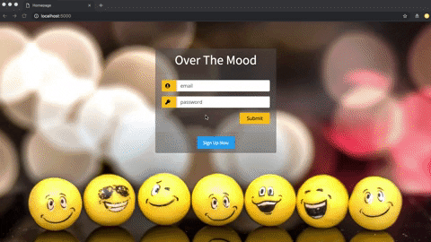
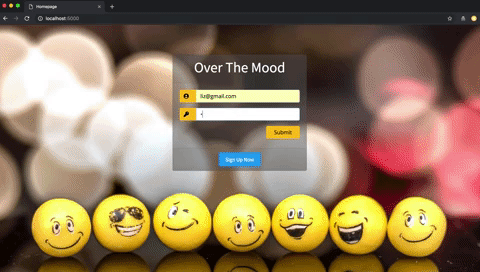
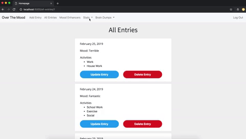
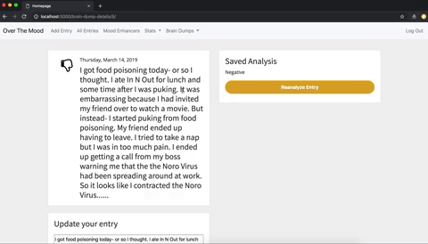

# Over The Mood

Over The Mood is a full stack web application that aims to improve mental health by allowing users to keep a log of their moods and associated activities. By tracking your mood and activity history, you can then determine which activities elicit positive moods and which trigger negative moods.

## Navigation

- [How It Works](#how-it-works)
- [Tech Stack](#tech-stack)
- [Setup and Installation](#setup)

## <a name="how-it-works"></a>How It Works

Upon registering, users will be prompted to add an entry by filling out a form which includes a mood and any number of selected activities. If a user enters a negative mood- they will be prompted to fill out three ways that would enhance their mood and save it to their profile. Users are then able to view a log of all their entries including two visualizations generated using chart.js- one for mood over time and another for total mood count. Users are also able to view activities associated with specific moods.

Users can dump their feelings and save it to their profile- similar to journal entries. With the help of Indico's Sentiment Analysis API, users can have their entry analyzed - which will predict if the entry was positive or negative. Users are then able to save the analysis to their profile.

Users can update and delete previously entered information including previous entries (mood and activities) and previous brain dumps. Users can also update their sentiment analysis for each brain dump entry.

**Register**



**Login/ Add New Entry**



**Data Visualization**



**Brain Dump Sentiment Analysis**



## <a name="tech-stack"></a>Tech Stack

<strong>Front-End:</strong> HTML/ CSS, Bootstrap, jQuery, JavaScript, AJAX, JSON, React, Chart.js <br>
<strong>API:</strong> Indico Sentiment Analysis <br>
<strong>Back-End:</strong> Python, Flask, Jinja, SQLAlchemy, PostgreSQL

## <a name="setup"></a>Set Up/ Installation

### Prerequisites

Please be sure to have Python 3.6 and PostgreSQL downloaded before you clone this repository.

### Installing

On local machine, go to a directory where you want to work and clone Over The Mood repository:

```
$ git clone https://github.com/lizlaw13/final-project.git
```

Get an API Key from <a href="https://indico.io/blog/docs/indico-api/installation/getting-your-api-key/">Indico</a> and save it to a file called `secrets.sh`:

```
export I_KEY="YOUR_KEY"
```

Create a virtual environment:

```
$ virtualenv env
```

Install dependencies:

```
$ pip3 install -r requirements.txt
```

Create database:

```
$ createdb tracker
```

Build database tables and fill database with seed file:

```
$ python3 model.py
$ python3 seed.py
```

### Running Locally via the Command Line

Be sure your virtual environment and `secrests.sh` file are activated:

```
source virtual env/bin/activate
source secrets.sh
```

Run Over The Mood:

```
$ python3 server.py
```

Open your browser and navigate to:

```
http://localhost:5000/
```

## Future Features

- Create a visualization for association between activities and moods
- Implement D3 visualizations
- Build own sentiment analysis tool

## Acknowledgments

Add Entry Icon made by <a href="https://www.flaticon.com/authors/good-ware" title="Good Ware">Good Ware</a> from <a href="https://www.flaticon.com/" 			    title="Flaticon">www.flaticon.com</a> and is licensed by <a href="http://creativecommons.org/licenses/by/3.0/" 			    title="Creative Commons BY 3.0" target="_blank">CC 3.0 BY</a></div>
